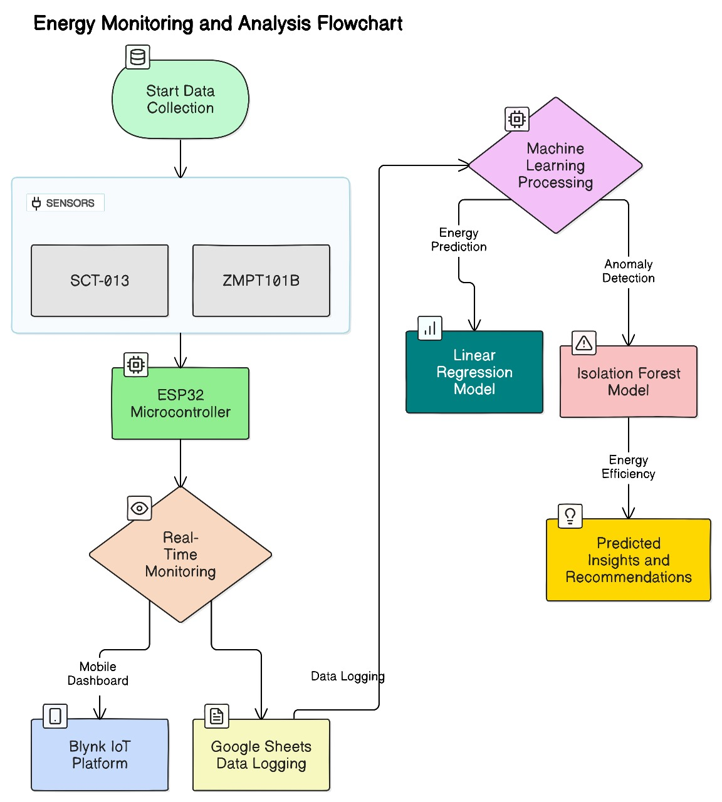
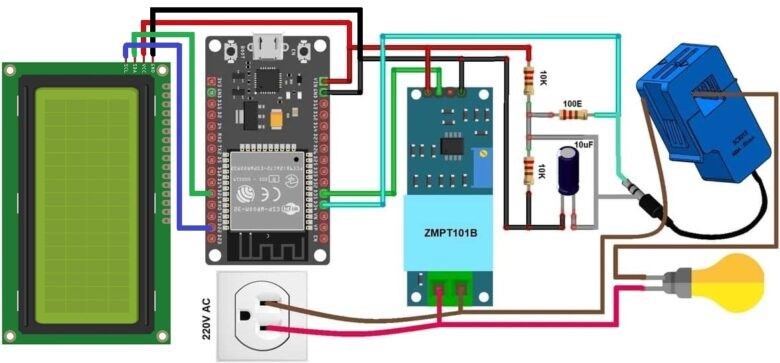
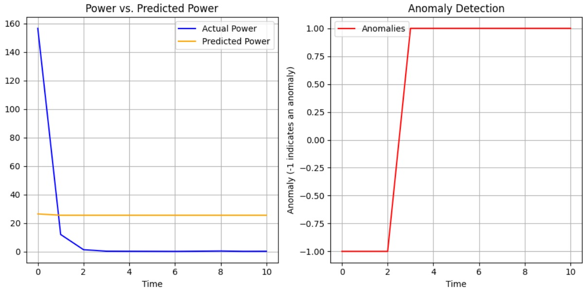
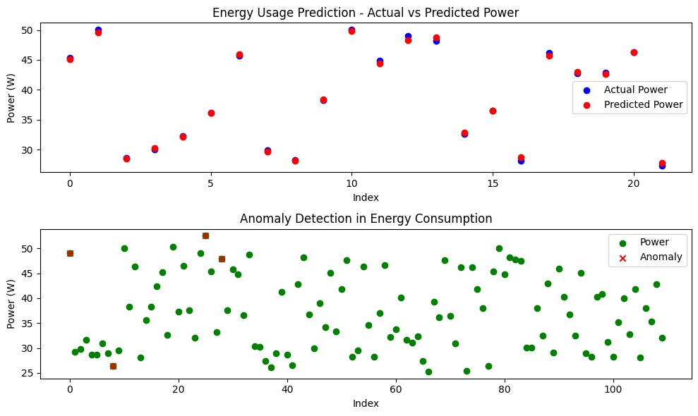

# 🌟 PowerGuard: ML-Driven Energy Monitor with Efficiency Insights & Anomaly Detection

## 📘 Project Overview
This project focuses on developing a **Smart Energy Monitoring System** using AI to:
- 🔍 Monitor real-time energy data.
- 📈 Predict future consumption.
- 🚨 Detect anomalies.
- 💡 Provide actionable insights for efficiency.

---

## 🎯 Objectives
1. ✅ **Real-Time Monitoring**: Voltage, current, power, and energy (kWh).
2. 📊 **Energy Prediction**: AI models like Linear Regression.
3. ⚠ **Anomaly Detection**: Isolation Forest algorithm.
4. 🌐 **Remote Monitoring**: Integrated with Blynk IoT.
5. 💡 **Efficiency Recommendations**: Optimize energy consumption.

---
### Energy Monitoring 📊

## 🔬 Methodology
1. **Hardware Setup** 🛠:
   - ESP32 microcontroller.
   - Voltage and current sensors.
2. **Data Handling** 📋:
   - Logs stored in Google Sheets.
3. **AI Integration** 🤖:
   - Linear Regression for predictions.
   - Isolation Forest for anomaly detection.
4. **User Interface** 📱:
   - Blynk IoT for real-time monitoring.

---

## 🚀 Results
1. **Real-Time Monitoring**: Accurate insights on energy use ⚡.
2. **Predictive Accuracy**: High reliability using AI 📈.
3. **Anomaly Detection**: Early alerts for inefficiencies ⚠.
4. **User Engagement**: Interactive dashboards on Blynk 📲.

---

## 🌿 Sustainability Contributions
This system aids in:
- 🌍 Reducing energy waste.
- 💰 Lowering energy costs.
- 🔄 Promoting sustainable practices.
- 
### Circuit Diagram 🛠

---

## 🛠 Technologies Used
- **ESP32 Microcontroller** 🧠
- **Blynk IoT Platform** 📡
- **Machine Learning** 📈
- **Google Sheets** 📝
- **Arduino IDE** 💻

---

### Energy Monitoring 📊

## 📜 References
- [Blynk Documentation](https://docs.blynk.io/)
- [ESP32 Official Guide](https://docs.espressif.com/projects/esp-idf/en/stable/esp32/index.html)
- [Scikit-Learn Linear Regression](https://scikit-learn.org/stable/modules/generated/sklearn.linear_model.LinearRegression.html)
- [Isolation Forest Example](https://scikit-learn.org/stable/auto_examples/ensemble/plot_isolation_forest.html)

---

🎉 **Thank you for exploring PowerGuard!**  
🔗 Feel free to contribute and share your thoughts on improving energy efficiency.
